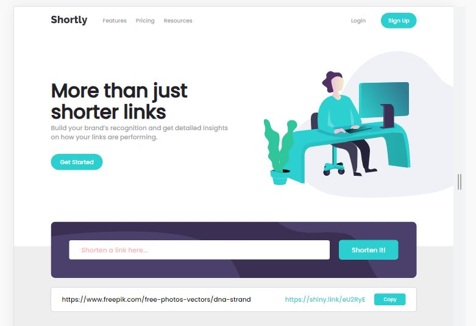

# Frontend Mentor - Shortly URL shortening API Challenge solution

This is a solution to the [Shortly URL shortening API Challenge challenge on Frontend Mentor](https://www.frontendmentor.io/challenges/url-shortening-api-landing-page-2ce3ob-G). Frontend Mentor challenges help you improve your coding skills by building realistic projects. 

## Table of contents

- [Overview](#overview)
  - [The challenge](#the-challenge)
  - [Screenshot](#screenshot)
  - [Links](#links)
- [My process](#my-process)
  - [Built with](#built-with)
  - [What I learned](#what-i-learned)
  - [Useful resources](#useful-resources)
- [Author](#author)

## Overview

This project is about shortening links;
Basicaly, the web-page is using API to shorten some links and then
lets you to copy the shortened link in the clip-board;
Design is fully responsive and looks good on both desktop and mobile devices.

### The challenge

Users should be able to:

- View the optimal layout for the site depending on their device's screen size
- Shorten any valid URL
- See a list of their shortened links, even after refreshing the browser
- Copy the shortened link to their clipboard in a single click
- Receive an error message when the `form` is submitted if:
  - The `input` field is empty

### Screenshot

### Links

- Solution URL: [solution URL](https://your-solution-url.com)
- Live Site URL: [live site URL](https://your-live-site-url.com)

## My process

- Created Desktop design first;
- Adjusted layout for mobile devices using CSS media queries;
- Add functionality via Javascript;

### Built with

- Semantic HTML5 markup
- CSS custom properties
- Flexbox
- CSS Grid

### What I learned

Mainly, I learned how to copy something to clip-board.

navigator.clipboard.writeText(getLink) - is the method to do so.

### Useful resources

- [Linnk Shortening API](https://app.shrtco.de/) - this is the link, where you can get the API from in order to shorten any link.

## Author

- Frontend Mentor - [@giorgi-2001](https://www.frontendmentor.io/profile/yourusername)

